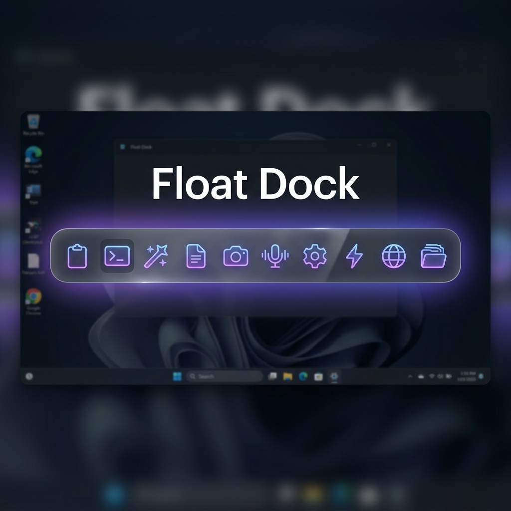
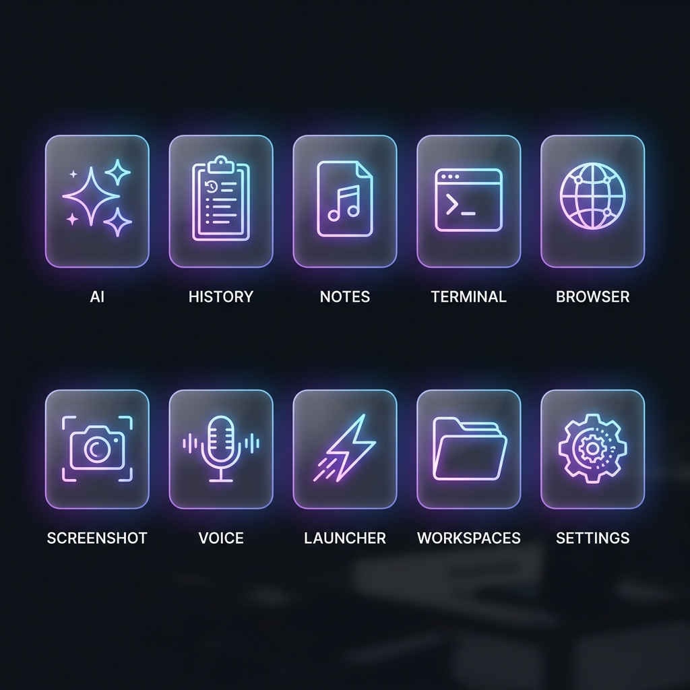
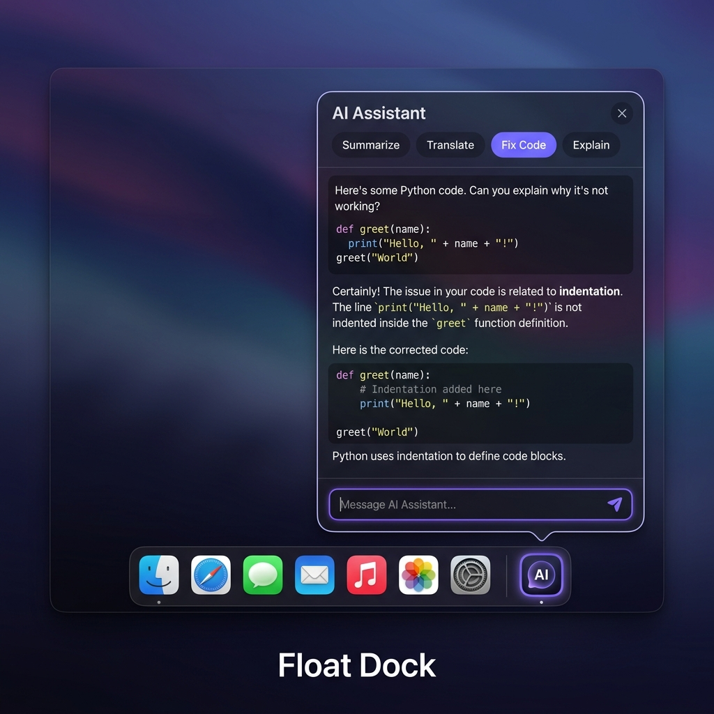
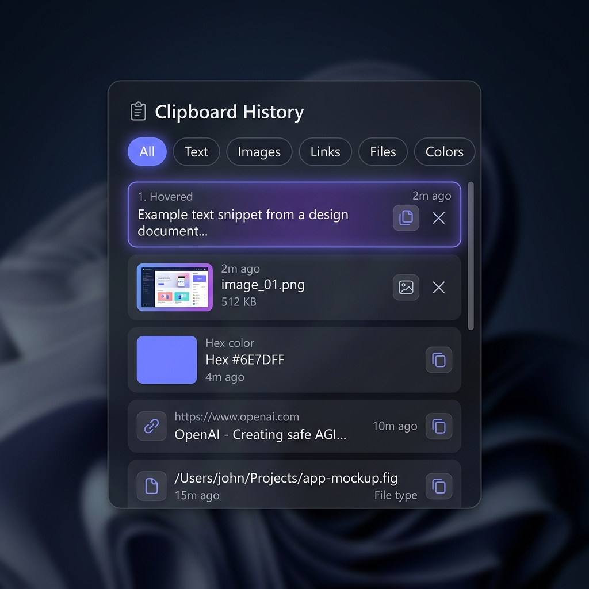

<div align="center">



<br />

# ⚓ Float Dock

### A sleek, floating productivity dock for Windows

[](https://www.electronjs.org/)
[](https://react.dev/)
[](https://vitejs.dev/)
[](LICENSE)
[](https://www.microsoft.com/windows)

**10 powerful tools in one elegant, always-on-top dock.**<br/>
AI assistant · Clipboard history · Terminal · Browser · Screenshots · Voice-to-text · Notes · Launcher · Workspaces · Settings

[Getting Started](#-getting-started) · [Features](#-features) · [Architecture](#-architecture) · [Contributing](#-contributing)

</div>

---

<br/>

<div align="center">

<p><em>The dock bar — minimal, elegant, always within reach</em></p>
</div>

<br/>

## ✨ What is Float Dock?

Float Dock is a **macOS-inspired floating dock** for Windows that puts 10 essential productivity tools at your fingertips. It hovers above all windows as a sleek, translucent bar — click any icon to launch a draggable, resizable panel.

Built with **Electron + React + Vite**, it features a premium dark glassmorphism UI with buttery-smooth animations, and runs as a lightweight overlay that stays out of your way until you need it.

<br/>

## 🎨 Features

<div align="center">

</div>

<br/>

<table>
<tr>
<td width="50%">

### ✨ AI Assistant
Chat with **Gemini 2.5 Flash** directly from your dock. Quick actions let you summarize, translate, fix code, or explain anything from your clipboard with one click.

</td>
<td width="50%">

### 📋 Clipboard History
System-wide clipboard manager tracking **text, images, files, links, and hex colors**. Filter by type, search, and re-copy any item. Stores up to 200 entries with intelligent deduplication.

</td>
</tr>
<tr>
<td>

### 🖥️ Terminal
A fully integrated **xterm.js** terminal powered by **node-pty**. Run PowerShell or CMD right from the dock — no need to switch windows.

</td>
<td>

### 🌐 Browser
A built-in browser with URL bar, bookmarks, history, and navigation controls. Browse the web without leaving your workflow. Sandboxed for security.

</td>
</tr>
<tr>
<td>

### 📸 Screenshots
Capture **full screen** or **individual windows** instantly. Screenshots are saved, thumbnailed, and browsable from a gallery. Copy, open, or delete with one click.

</td>
<td>

### 🎤 Voice to Text
Speech recognition powered by the **Web Speech API**. Dictate text and copy the transcription to your clipboard — perfect for quick notes.

</td>
</tr>
<tr>
<td>

### 📝 Quick Notes
A rich-text note editor with **WYSIWYG formatting** — headings, bold, italic, lists, code blocks, blockquotes, and checkboxes. Pin important notes to the top.

</td>
<td>

### ⚡ Quick Launcher
Spotlight/PowerToys-style **app launcher**. Searches your Start Menu and system apps with fuzzy matching. Navigate with keyboard, press Enter to launch.

</td>
</tr>
<tr>
<td>

### 📁 Workspace Snapshots
Save and restore your **entire desktop workspace** — open applications, window positions, and dock state. Switch between project contexts in seconds.

</td>
<td>

### ⚙️ Settings
Configure dock position, always-on-top behavior, launch-on-startup, clipboard limits, and view keyboard shortcuts. All preferences persist across sessions.

</td>
</tr>
</table>

<br/>

<div align="center">

&nbsp;&nbsp;&nbsp;

<p><em>AI Assistant and Clipboard History panels — draggable, resizable, beautiful</em></p>
</div>

<br/>

## 🚀 Getting Started

### Prerequisites

- **Node.js** 18+ and **npm**
- **Windows 10/11** (primary platform)
- A **Gemini API key** from [Google AI Studio](https://aistudio.google.com/apikey) (for the AI feature)

### Installation

```bash
# Clone the repository
git clone https://github.com/Nyx-abu/float-dock.git
cd float-dock

# Install dependencies
npm install

# Configure your API key
cp .env.example .env
# Edit .env and add your Gemini API key
```

### Running in Development

```bash
# Start both Vite dev server and Electron
npm run dev

# Or run them separately:
npm run dev:vite     # Start Vite (React HMR)
npm run dev:electron # Start Electron
```

### Building for Production

```bash
npm run build
```

### Keyboard Shortcut

| Shortcut | Action |
|---|---|
| `Ctrl + Shift + D` | Toggle dock visibility |

<br/>

## 🏗️ Architecture

```
float-dock/
├── electron-main.js          # Main process — IPC handlers, window management
├── preload.js                # Secure bridge between main & renderer
├── src/
│   ├── App.jsx               # Root component
│   ├── main.jsx              # React entry point
│   ├── components/
│   │   ├── DockMenu.jsx      # The dock bar with all icons
│   │   ├── ResizablePanel.jsx # Shared draggable + resizable panel wrapper
│   │   ├── AiPanel.jsx       # AI chat interface
│   │   ├── ClipboardPanel.jsx # Clipboard history
│   │   ├── TerminalPanel.jsx  # Integrated terminal
│   │   ├── BrowserPanel.jsx   # Built-in browser
│   │   ├── ScreenshotPanel.jsx # Screenshot capture
│   │   ├── VoicePanel.jsx     # Voice-to-text
│   │   ├── NotesPanel.jsx     # Rich text notes
│   │   ├── LauncherPanel.jsx  # App launcher
│   │   ├── WorkspacePanel.jsx # Workspace snapshots
│   │   └── SettingsPanel.jsx  # Settings
│   ├── hooks/
│   │   └── usePanelPosition.js # Dragging + positioning logic
│   ├── workspace/
│   │   ├── SnapshotManager.js  # Save/load workspace snapshots
│   │   ├── WindowTracker.js    # Track open windows
│   │   └── TerminalManager.js  # Terminal session management
│   └── styles/
│       ├── global.css
│       ├── DockMenu.css
│       ├── panels.css          # Panel animations & shared styles
│       └── ...
├── .env.example              # API key template
└── package.json
```

### Tech Stack

| Layer | Technology | Purpose |
|---|---|---|
| **Framework** | Electron 40 | Desktop app shell, system APIs |
| **UI** | React 18 | Component-based UI |
| **Build** | Vite 5 | Fast HMR & bundling |
| **Terminal** | xterm.js + node-pty | Embedded terminal emulator |
| **AI** | Google Gemini 2.5 Flash | AI chat & text processing |
| **Panels** | re-resizable | Resizable panel containers |

<br/>

## 🔒 Security

Float Dock takes security seriously, especially as a desktop application with system-level access:

| Measure | Details |
|---|---|
| **Context Isolation** | Renderer runs in a sandboxed context with `contextIsolation: true` |
| **IPC Allowlists** | Both `invoke()` and `send()` channels are allowlisted in the preload script |
| **No Node Integration** | Renderer has no direct access to Node.js APIs |
| **Env Filtering** | Sensitive environment variables (API keys, tokens) are stripped from PTY sessions |
| **Input Validation** | Shell commands use argument arrays (no string interpolation) to prevent injection |
| **Path Traversal Protection** | File operations validate paths are within expected directories |
| **Webview Sandboxing** | Browser panel uses isolated partition and blocks dangerous URL schemes |
| **API Key Safety** | `.env` is gitignored; keys never enter version control |

<br/>

## 🎮 Usage Tips

- **Drag panels freely** — grab any panel header to move it anywhere on screen
- **Resize from any edge** — all panels support 8-direction resizing
- **Toggle with hotkey** — `Ctrl+Shift+D` hides/shows the dock instantly
- **Clipboard auto-tracks** — just copy anything on your system and it appears in history
- **Quick AI actions** — copy text, then click "Summarize" or "Fix Code" for instant results
- **Keyboard launcher** — type to search, arrow keys to navigate, Enter to launch

<br/>

## 🤝 Contributing

Contributions are welcome! Here's how to get started:

1. **Fork** the repository
2. **Create** a feature branch (`git checkout -b feature/amazing-feature`)
3. **Commit** your changes (`git commit -m 'Add amazing feature'`)
4. **Push** to the branch (`git push origin feature/amazing-feature`)
5. **Open** a Pull Request

### Development Notes

- The app uses ES Modules (`"type": "module"` in package.json)
- Preload script uses CommonJS (required by Electron)
- `node-pty` requires native compilation — run `npm install` with build tools available
- Hot reload works for the React UI; Electron main process requires restart

<br/>

## 📄 License

This project is licensed under the **MIT License** — see the [LICENSE](LICENSE) file for details.

<br/>

---

<div align="center">

**Built with ❤️ and way too much coffee**

<sub>Float Dock — because Alt+Tab is so last decade.</sub>

</div>
