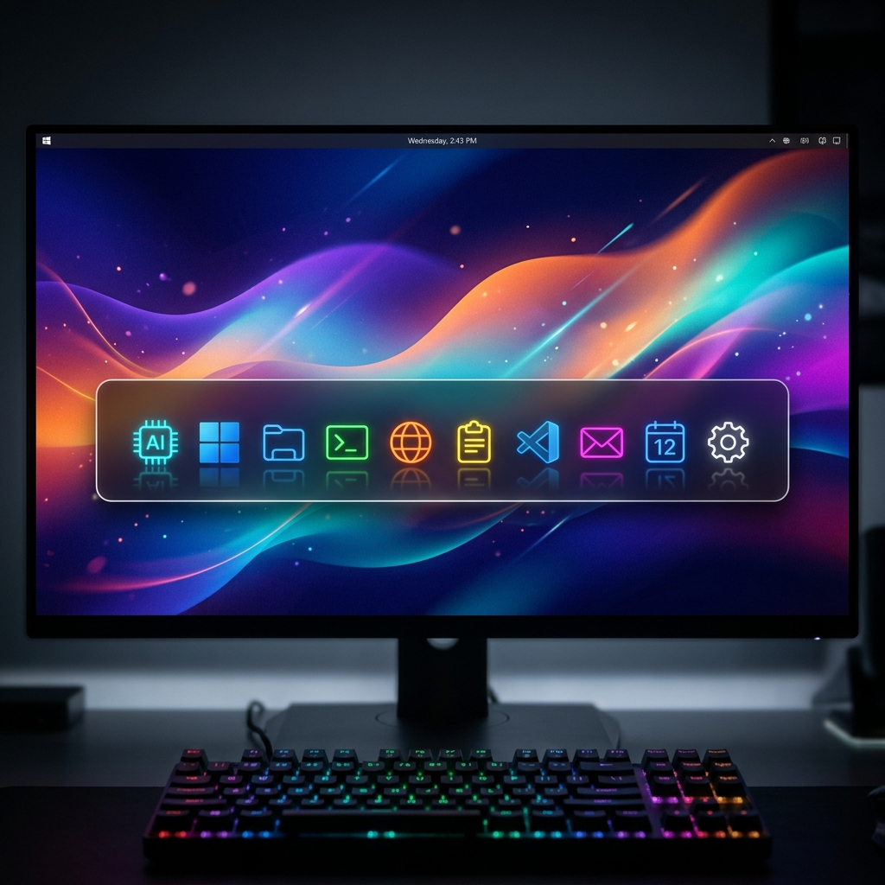
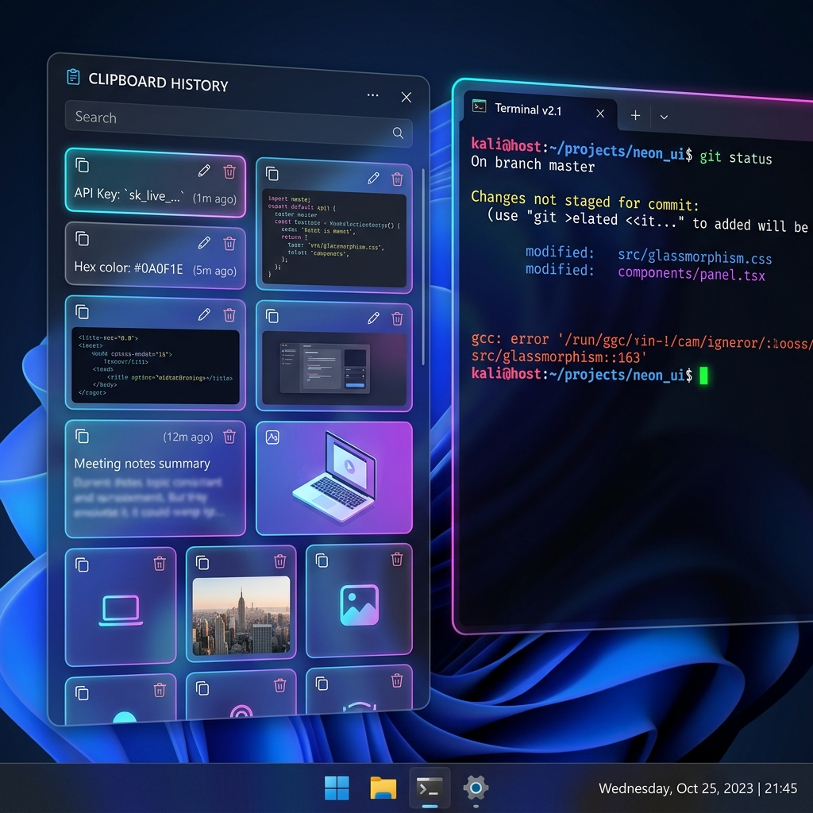
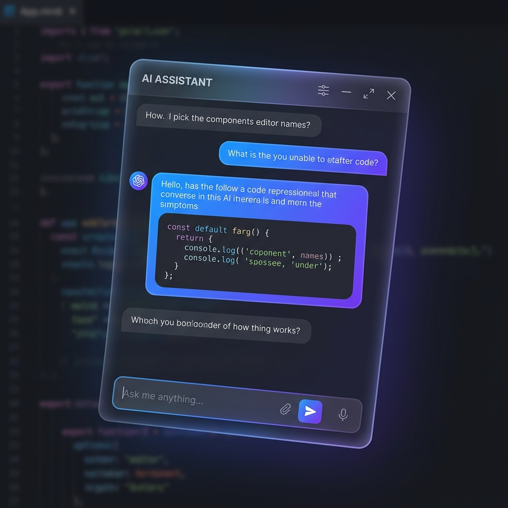

<div align="center">

# 🌊 Float Dock

**Your digital arsenal, hovering at your fingertips.**

[](https://github.com/Nyx-abu/float-dock/releases)
[](https://www.electronjs.org/)
[](https://react.dev/)
[](LICENSE)
[](https://www.microsoft.com/windows)

<br/>



<br/>
<br/>

**10 powerful tools in one elegant, always-on-top, macOS-style dock.**
*AI Assistant · Clipboard History · Terminal · Browser · Screenshots · Voice-to-text · Notes · Launcher · Workspaces · Settings*

[Getting Started](#-getting-started) · [Features](#-features) · [Architecture](#-architecture) · [Contributing](#-contributing)

</div>

---

<br/>

## ✨ The Vision

Float Dock reimagines how you interact with your desktop. Instead of digging through windows, menus, and shortcuts, **Float Dock** is a sleek, dark-mode bar that rests unobtrusively at the bottom of your screen. One click reveals a beautiful, glassmorphic panel overlay housing the specific tool you need.

It’s fast. It’s fluid. It’s the ultimate productivity hack for Windows power users.

<br/>

<div align="center">
  
  <p><em>Seamless, draggable overlays that enhance—not interrupt—your workflow.</em></p>
</div>

<br/>

## 🎨 The Arsenal

<table>
<tr>
<td width="50%" valign="top">

### ✨ AI Assistant
Chat with **Gemini 2.5 Flash** instantly. Summarize, translate, fix code, or explain snippets. Quick actions populate the sleek input area, allowing you to edit the prompt before sending.

</td>
<td width="50%" valign="top">

### 📋 Clipboard History
A system-wide clipboard manager tracking **text, images, files, links, and colors**. Stores up to 200 entries with intelligent deduplication and a breathtaking fullscreen image preview.

</td>
</tr>
<tr>
<td valign="top">

### 🖥️ Terminal
An integrated **xterm.js** terminal powered by **node-pty**. Run PowerShell or CMD directly from the dock. Beautiful Dracula-inspired syntax highlighting built in.

</td>
<td valign="top">

### 🌐 Browser
A sandboxed webview browser with bookmarks, history, and navigation controls. Look up documentation or test web apps without leaving your context.

</td>
</tr>
<tr>
<td valign="top">

### 📸 Screenshots
Capture **fullscreen** or **individual windows**. Access a beautiful grid gallery of your snaps. Click to preview, copy to clipboard, or manage your visual assets instantly.

</td>
<td valign="top">

### 🎤 Voice to Text
Powered by **Gemini AI**, this tool records your speech and processes it via the secure main process. Seamlessly dictate notes or commands with high accuracy.

</td>
</tr>
<tr>
<td valign="top">

### 📝 Quick Notes
A distraction-free, rich-text WYSIWYG editor. Format with headings, bold, italic, code blocks, and checkboxes. Pin important thoughts directly to your workspace.

</td>
<td valign="top">

### ⚡ Quick Launcher
A Spotlight-style **app launcher**. Rapidly scan your Start Menu and system apps with fuzzy matching. Keyboard-driven for maximum speed.

</td>
</tr>
<tr>
<td valign="top">

### 📁 Workspace Snapshots
Save the state of your **entire desktop workspace**—open apps, positions, and dock state. Switch between project contexts in a heartbeat.

</td>
<td valign="top">

### ⚙️ Settings
Granular control over dock position, aesthetics, blur, scale, and keyboard shortcuts. Tailor the experience to perfectly match your workflow setup.

</td>
</tr>
</table>

<br/>

<div align="center">
  
  <p><em>The AI Assistant interface—modern tech aesthetic, smooth gradients, and glassmorphism.</em></p>
</div>

<br/>

## 🚀 Getting Started

### Prerequisites

- **Node.js** 18+ and **npm**
- **Windows 10/11** (primary platform)
- A **Gemini API key** from [Google AI Studio](https://aistudio.google.com/apikey)

### Installation

```bash
# Clone the repository
git clone https://github.com/Nyx-abu/float-dock.git
cd float-dock

# Install dependencies
npm install

# Configure your API key
cp .env.example .env
# Edit .env and add your Gemini API key
```

### Running in Development

```bash
# Start both Vite dev server and Electron
npm run dev
```

### Keyboard Shortcuts

| Shortcut | Action |
|:---|:---|
| <kbd>Ctrl</kbd> + <kbd>Shift</kbd> + <kbd>D</kbd> | Toggle dock visibility |

<br/>

## 🔒 Security Posture

Float Dock is designed with a defense-in-depth security model:
- **Context Isolation:** The renderer runs in a highly restricted sandbox (`contextIsolation: true`).
- **Strict IPC:** Explicitly allowlisted channels bridge the main and renderer processes.
- **Node Integration Disabled:** The UI layer has zero access to Node.js APIs.
- **API Key Safety:** The `.env` variables (like your Gemini API key) are sequestered in the main process and never touch the UI layer.

<br/>

## 🤝 Contributing

We love contributions! Float Dock thrives on community input.

1. **Fork** the repository
2. **Create** a feature branch (`git checkout -b feature/amazing-feature`)
3. **Commit** your changes (`git commit -m 'Add amazing feature'`)
4. **Push** to the branch (`git push origin feature/amazing-feature`)
5. **Open** a Pull Request

<br/>

---

<div align="center">
  <strong>Engineered with precision for power users.</strong><br/>
  <em>Float Dock — because Alt+Tab is so last decade.</em><br/><br/>
  <a href="LICENSE">MIT License</a>
</div>
